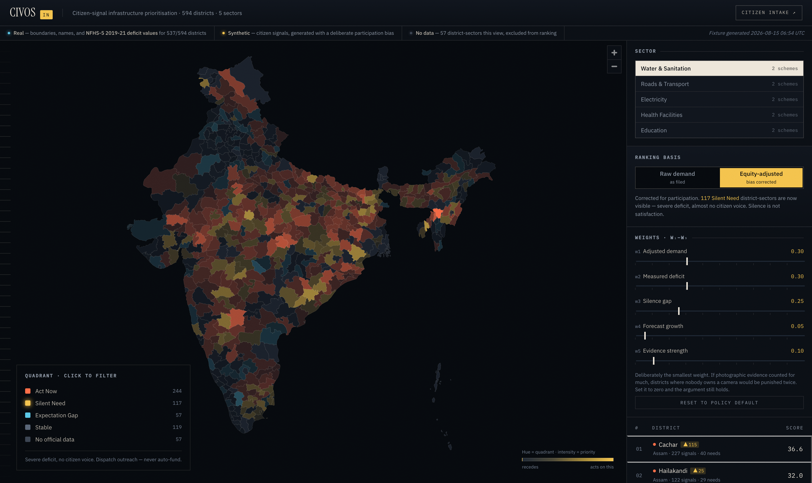
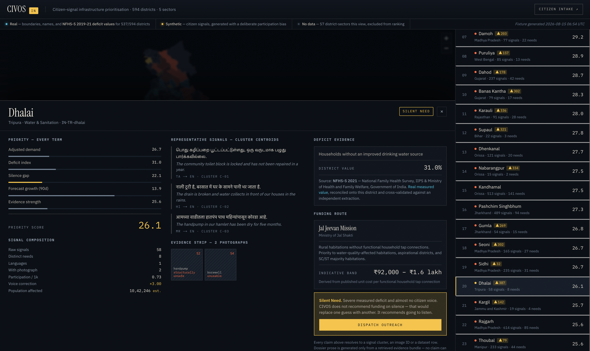
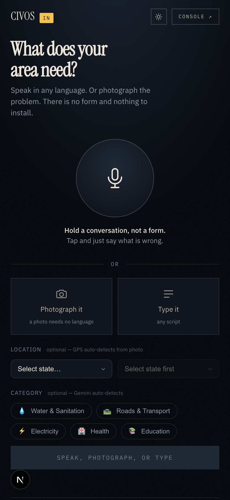

<div align="center">

# CIVOS

**The civic operating system — citizen-signal-driven infrastructure prioritisation for BRICS governments**

Speak it, type it, or photograph it. In any language. CIVOS turns citizen requests
into a costed, evidence-cited project dossier tied to a real government funding scheme —
and finds the districts that never speak up at all.

[](LICENSE)
[](OWNERSHIP.md)
[](docs/GATE0-RESULT.md)
[](docs/LANGUAGE-COVERAGE.md)

Built for **Build with AI: Code for Communities — Second Edition** (Google Cloud × Hack2skill)
· problem statement **PS-01**, AI for Digital Public Infrastructure & Governance.

</div>



---

## The problem, and the part everyone misses

Governments across BRICS nations are not short of citizen feedback. They are
drowning in it — grievance portals, ward meetings, helplines, social media, all in
mutually unintelligible systems. What they lack is a way to turn any of it into a
funding decision that survives an audit.

There is a second failure that is easier to miss, and it is the one CIVOS is built
around:

> **A map of complaints is a map of who owns a phone and knows how to complain.
> It is not a map of need.**

Every voice-based or app-based feedback channel over-samples the loud, connected,
literate, urban citizen. Rank districts by request volume and you systematically
defund the poorest and least-connected — the exact inversion of the mission.
Silence gets read as satisfaction when it is usually the absence of access.

So CIVOS measures how much each district **speaks** against how much each district
**lacks**:

|  | Official data says conditions are OK | Official data says conditions are bad |
|---|---|---|
| **Many complaints** | **Expectation Gap** — your dataset may be stale, or the service exists but is bad | **Act Now** — corroborated need. Fund it. |
| **Few complaints** | **Stable** — no action | **Silent Need** — severe deficit, no voice. **Go and listen.** |

That bottom-right cell is the product. And CIVOS never auto-funds silence — that
would replace one guess with another. It dispatches **outreach**. It is a
bias-correction mechanism, not an override of citizen input, and the interface
says so on the card itself.

---

## The five verdicts, and what each one means

Every district-sector pair gets exactly one verdict. Four are positions in the 2×2
above; the fifth is a disclosure rather than a judgement.

The two axes are deliberately independent:

- **Demand** — how much citizens complain. The synthetic signal layer, generated
  from real deprivation × real participation capacity.
- **Deficit** — how bad conditions actually are. Real NFHS-5 2019-21.

Each axis is split at **the median for that sector**, not at a fixed number, because
a 15% water deficit and a 15% electricity deficit mean different things in India.
For Water & Sanitation today those medians are demand 11.8 and deficit 15.7.

Examples below are live values from `console/public/data/scores.json`.

### 🔴 Act Now — *corroborated need*

**High demand, high deficit.** Citizens complain and official data agrees.

> **Cachar, Assam** — demand 25.2, deficit 49.3%

Two independent sources point the same way, so there is nothing to argue about.
**Fund it.** This is the quadrant a conventional grievance dashboard would also
find; CIVOS claims no credit for it.

### 🟡 Silent Need — *severe deficit, no voice*

**Low demand, high deficit.** This is the product.

> **Pashchimi Singhbhum, Jharkhand** — demand 6.2, deficit 41.5%, **22.9%** of women
> with 10+ years of schooling against a 40.8% national mean

Its deficit is close to Cachar's; its demand is a quarter of it. The reason is
measurable rather than mysterious — fewer residents can navigate a grievance
process, so fewer complaints arrive. Rank by volume and this district is defunded
for being quiet.

**CIVOS never auto-funds silence.** A Silent Need verdict dispatches **outreach** —
*go and ask* — not a transfer. Auto-funding would replace one guess with another;
the point is to repair a measurement gap, not to overrule citizens. The console says
so on the card itself.

### 🔵 Expectation Gap — *complaints exceed measured deficit*

**High demand, low deficit.**

> **Coimbatore, Tamil Nadu** — demand 21.2, deficit 10.8%, **470 signals**, 62.8%
> schooling

Note the shape: the highest signal count in the sector sitting on one of the lowest
deficits. Two honest readings, and CIVOS does not choose between them:

1. **The dataset is stale** — conditions worsened since NFHS-5 was collected in 2019-21.
2. **The service exists but is bad** — a tap that runs twice a month still counts as
   "connected" in a coverage statistic.

Either way the action is **re-survey**, not fund. This quadrant is also a check on
the model: it is where high participation capacity produces complaint volume out of
proportion to need — the exact bias the equity correction removes.

### ⚪ Stable — *no action indicated*

**Low demand, low deficit.**

> **Kohima, Nagaland** — demand 10.1, deficit 11.3%, 70.9% schooling

Listed rather than hidden, so the four verdicts account for every scored
district-sector and none is quietly dropped.

### ⬛ No official data — *a disclosure, not a verdict*

CIVOS could not load a real deficit value, so the district **cannot be placed on the
deficit axis at all**.

Those rows are **excluded from the ranking, never scored as zero.** A zero would
rank them last — indistinguishable from *conditions here are excellent*. They render
grey, and the calibration strip counts them permanently on screen.

Two cases produce it:

| | Count | Why |
|---|---|---|
| Districts NFHS-5 could not be reconciled onto | 2 of 641 | Boundary/census mismatch, plus one sentinel polygon for the area where enumeration did not happen |
| **Roads & Transport, every district** | **641 of 641** | No open dataset carries a district-level road-connectivity deficit — see [docs/ROADS-INDICATOR.md](docs/ROADS-INDICATOR.md) |

### Why the structure exists at all

> **A map of complaints is a map of who owns a phone and knows how to complain.
> It is not a map of need.**

Rank by complaint volume and Coimbatore's 470 signals outrank Pashchimi Singhbhum's
89 — money flows toward 62.8% schooling and away from 22.9%, which is the exact
inversion of the mission. The quadrant model exists so that the district which
*cannot* complain stays visible.

**One thing to keep straight:** the deficit axis is **real** and the demand axis is
**synthetic**, labelled as such everywhere it surfaces. What is real inside the
synthetic layer is the *bias*: it is generated from measured deprivation × measured
schooling and electricity, which is why Silent Need lands on genuinely deprived
districts rather than wherever a hash pointed.

---

## Try it

Requires [Node 20+](https://nodejs.org). No cloud credentials needed — the console
runs against a committed fixture.

```bash
git clone https://github.com/ojha-436/CIVOS.git
cd CIVOS/console
npm install
npm run dev          # http://localhost:3000
```

| Route | What it is | Account |
|---|---|---|
| **`/`** | **Landing** — what CIVOS is, the participation-bias argument, the three loops, and the Telegram channel | public |
| **`/login`** | **Sign in / sign up** — email + password, or Google SSO | — |
| **`/profile`** | **Profile** — role, organisation, jurisdiction. Every field optional | signed in |
| **`/console`** | **Policymaker console** — 641 real districts, quadrant choropleth, live weight sliders, drilldown dossier | **required** |
| **`/report`** | **Citizen intake** — microphone, camera and text in one widget, mobile-first | **required** |
| **Telegram** `@Civos_in_bot` | Same intake, voice · text · photo | **none** |

<table>
<tr>
<td width="50%"><br><em>The dossier — every claim resolves to a signal cluster, an image, or a dataset row</em></td>
<td width="50%"><br><em>Citizen intake — no form, no app, no language selector</em></td>
</tr>
</table>

---

## The three loops

```
LOOP 1 · LISTEN
  web widget (mic · camera · text)  ┐
  Telegram bot (voice · text · photo)├─► ONE Gemini multimodal call ─► NormalisedSignal
  bulk CSV importer (legacy systems)┘   language auto-detect · sector · severity
                                        visual asset · condition · geo hint
                                        EXIF GPS ─► ST_CONTAINS ─► exact district

LOOP 2 · DECIDE  (BigQuery, asia-south1)
  ML.GENERATE_EMBEDDING + VECTOR_SEARCH ─► distinct needs, duplicate-photo check
  official deficit data                 ─► DeficitIndex
  participation correction              ─► VoiceCorrection, AdjustedDemand
  ARIMA_PLUS                            ─► 90-day forecast
  quadrant assignment + scheme match    ─► Act Now / Silent Need / …
  AI.GENERATE from a retrieved bundle   ─► grounded project dossier

LOOP 3 · VERIFY
  post-funding signal decay · before/after image pair on the same asset,
  matched by image embedding + admin unit — did the thing actually get fixed?
```

**One call, three modalities.** Gemini accepts audio, text and image parts in the
same request, so there is a single extraction function with a single output
schema — not three pipelines. Each modality buys something distinct:

| | What it buys |
|---|---|
| 🎙 **Voice** | **Access.** No literacy, no form, no departmental vocabulary. The only channel that reaches the citizens the system is most at risk of missing. |
| ⌨️ **Text** | **Scale.** Messaging apps, and bulk import of the millions of complaints already sitting in legacy systems. This is how you defragment instead of becoming fragment #5. |
| 📷 **Image** | **Evidence.** A voice note is a claim; a photo is corroboration. It is also the highest-confidence geo path (EXIF), the only modality that can verify a fix — and it needs no language at all. |

---

## Cross-border is a schema problem, not a translation problem

Two languages in a demo is translation. The real question is whether Brazil's
ministry can run this next month — which is only yes if the country layer is a
**configuration directory**, not code.

```
adapters/in/     languages.yaml · sectors.yaml · schemes.yaml   ← CIVOS-IN
adapters/za/     the same four files                            ← CIVOS-ZA
core/            contains ZERO country literals
```

Enforced, not asserted. `scripts/lint_country_literals.py` fails the build if a
country name, ISO code, scheme, dataset or language reaches `core/`. It parses
rather than greps — `IN` is a SQL keyword and `in` is an English preposition, so
the obvious regex matches nearly every line of Python ever written.

```bash
uv run python scripts/lint_country_literals.py
```

It runs as the **`Country lint (SPEC P0-14)`** job in
[`.github/workflows/deploy.yml`](.github/workflows/deploy.yml), and the deploy job
declares `needs: lint` — so a country literal in `core/` blocks the release rather
than being noticed later. The gate takes no cloud credentials, which is
deliberate: it should fail before anything touches GCP.

That job also **proves the gate can fail before trusting it to pass.** It writes a
throwaway file containing `"India"` and a named scheme, runs the linter over it,
and fails the build if the linter *accepts* it. A checker quietly broken into
always returning PASS would otherwise show green forever, and a green badge that
cannot go red is worth less than no badge at all. It additionally counts the
Python files under `core/` first, because the linter reports PASS when it matched
nothing — so a renamed or emptied `core/` cannot sail through as a zero-file
"pass".

---

## What is real, and what is not

Stated here, in the interface, and in every dossier. A labelled substitution is
worth more than mystery data.

| Layer | Status |
|---|---|
| District boundaries, names, administrative codes | **Real** — 641 districts, DataMeet Census-2011 (CC-BY 4.0), simplified for web rendering |
| Sector deficit indicators | **Real** — NFHS-5 2019-21 (IIPS / MoHFW), 639 of 641 districts, 4 of 5 sectors. Cross-validated against a second independent extraction: 100% identical. See [provenance](docs/DATA-RECONCILIATION.md) |
| Funding schemes and unit costs | **Real** — ten named central schemes with published unit costs |
| Evidence photographs | **Real** — openly licensed, individually attributed. *Never generated:* vision accuracy demonstrated on synthetic images would prove nothing |
| Citizen signals (voice and text) | **Synthetic** — no government data access. Generated from real geography and real deficits with a **deliberate participation bias**, because that bias is what the product detects. Both terms of that bias are real NFHS-5 values: deprivation × participation capacity (women's schooling + household electricity) |
| District population | **Real** — Census 2011 via Wikidata (CC0), 526 of 641 districts. The remaining 115 carry *no* figure and the dossier says so rather than estimating |
| Roads & Transport deficit | **Real** — Census 2011 Village Directory, villages without a black-topped (pucca) road, 617 districts. Carries a **disclosed caveat**: enumerators coded this field inconsistently between states, so cross-state comparison is weaker than for the NFHS-5 sectors. The caveat shows permanently in the console and in every dossier citing the sector — [reasoning and the six sources rejected first](docs/ROADS-INDICATOR.md) |

The generator ships as part of the public good: a reference dataset and pilot
simulator, so a ministry can trial CIVOS *before* it has data.

---

## Open data sources

Every dataset CIVOS reads, where it comes from, what licence it carries, and what
is still unresolved. A system whose central argument is that measurement bias
distorts funding does not get to be vague about its own inputs — so gaps below are
named rather than smoothed over.

| # | Layer | Source | Publisher | Licence | Status |
|---|---|---|---|---|---|
| 1 | Sector deficit indicators | NFHS-5 2019-21 district factsheets | IIPS / MoHFW, Government of India | GoI statistics — see §1 | **Real**, 639/641 districts, 4 of 5 sectors |
| 2 | District boundaries | **DataMeet** Census-2011 district shapefile | DataMeet India community | **CC-BY 4.0** | **Real**, 641 districts, carries census codes |
| 3 | District & state name list | `console/public/data/india-districts.json` | derived from the boundary set | follows §2 | **Real**, 35 states / UTs, 641 districts |
| 4 | Funding schemes & unit costs | Published central scheme norms | Respective Union ministries | Government publications | **Real**, 10 schemes |
| 5 | Evidence photographs | Wikimedia Commons | Individual contributors | **CC-BY**, per-image | **Real**, 150 images, individually attributed |
| 6 | Typefaces | IBM Plex, Instrument Serif | IBM Corp.; Rodrigo Fuenzalida & Iván Reyes Ramírez | **SIL OFL 1.1** | **Real**, vendored |
| 7 | Citizen signals | generated by CIVOS | — | CC-BY-4.0 (ours) | **Synthetic**, labelled everywhere |
| 8 | District population | **Census 2011** via Wikidata | Wikidata contributors | **CC0** | **Real**, 526/641 districts; null elsewhere — see §7 |
| 9 | Participation capacity | **NFHS-5** — women's schooling + household electricity | IIPS / MoHFW | as §1 | **Real**, 639 districts — see §8 |
| 10 | Roads & Transport deficit | **Census 2011 Village Directory** — pucca road access | MHA / ORGI | **NDSAP** (open) | **Real**, 617 districts, with a disclosed state-coding caveat — see §9 |

### 1. NFHS-5 — the deficit layer

The National Family Health Survey 2019-21 district factsheets, published by the
**International Institute for Population Sciences (IIPS)** for the **Ministry of
Health and Family Welfare, Government of India**.

`rchiips.org`, the official host, returned 404 with an invalid TLS certificate at
build time, so the PDFs could not be retrieved at source. **Two independent
community extractions were used instead and cross-validated against each other
rather than trusted** — they agree to the decimal on all five indicators across
275 districts in common. Full provenance, the 404, and the cross-validation table:
[`docs/DATA-RECONCILIATION.md`](docs/DATA-RECONCILIATION.md).

On licensing: the values are Government of India statistics. Facts are not
copyrightable, and the two repositories are *transport, not authorship* — a
position supported by the fact that two independent extractions produced identical
figures. One extraction states CC-BY-4.0; the other states no licence.

**Five indicators are used, of 105 distinct indicators in the primary extraction:**

| Indicator | Sector |
|---|---|
| Households without an improved drinking water source | Water & Sanitation |
| Households without an improved sanitation facility | Water & Sanitation |
| Households without an electricity connection | Electricity |
| Births not delivered in a health facility | Health Facilities |
| Females age 6+ who never attended school | Education |

The other 100 are downloaded and unused. Two of them —
*Women with 10 or more years of schooling (%)* and *Population living in households
with electricity (%)* — are the obvious real replacements for the connectivity
placeholder in §8. See [REVISION-PLAN.md](REVISION-PLAN.md) R1.

### 2. District boundaries — DataMeet Census 2011

`console/public/data/districts.geojson` — **641 districts**, CC-BY 4.0, rebuildable
with `scripts/build_boundaries.py`. Full attribution and the reasoning:
[`docs/BOUNDARY-ATTRIBUTION.md`](docs/BOUNDARY-ATTRIBUTION.md).

> District boundaries by the [DataMeet India community](http://datameet.org/)
> ([CC BY 4.0](https://creativecommons.org/licenses/by/4.0/)).

**This layer was replaced on 17 Aug 2026, and the reason is worth stating.** The
previous file came from an unrecorded 33 MB "public GeoJSON" that the code
identifies as **GADM** — `generate_console_fixtures.py` read `NAME_1`/`NAME_2`,
GADM's property convention, and the deficit builder aliased state names back to
GADM 2.x spellings (`orissa`, `uttaranchal`, `nctofdelhi`).

**GADM prohibits redistribution without prior permission.** CIVOS publishes a
derived copy of the geometry, so that was a licensing conflict — on the one layer
where a Digital Public Good claim is least able to afford one. It is recorded here
rather than quietly corrected.

The replacement is better on the merits, not only on licensing:

| | GADM (previous) | DataMeet (current) |
|---|---|---|
| Licence | redistribution prohibited | **CC-BY 4.0** |
| Districts | 594 | **641** |
| Census codes in properties | absent | **`st_cen_cd` + `dt_cen_cd`** |
| NFHS-5 reconciliation | 537/594 = 90.4%, fuzzy names | **639/641 = 99.7%, census-code join** |
| State naming | 2011-era | modern |
| Rebuildable from the repo | no | **yes** |

Carrying the census codes is the substantive gain. NFHS-5's extraction carries the
same `ST_CEN_CD` / `DT_CEN_CD` pair, so districts now join on an integer pair
instead of on fuzzy-matched English names — **628 of 641 by exact code**. That
removes a class of silent error the project had already been bitten by once: the
earlier name matcher married Sikkim's *East* district to Delhi's *East*, which
would have painted one district's deprivation onto another with nothing on screen
to show for it.

**One sentinel polygon is excluded from the data but kept on the map.** The upstream
shapefile carries `DISTRICT = "Data Not Available"` with census codes `99/99` for
the area where enumeration did not happen, and NFHS carries a matching placeholder
row — so a naive join produced a "district" with 0% schooling and 0% electricity.
That is the absence of a measurement, not a district with terrible indicators, and
left in it dragged the participation-capacity floor from 39.0 to 0.0 and compressed
every real district's score. It is now flagged in the boundary properties, excluded
from reconciliation and capacity, and rendered as no-official-data. The land exists;
the data does not.

### 3. District and state list

`console/public/data/india-districts.json` — 35 states and union territories
mapped to their districts, powering the state → district dropdowns on the citizen
intake page. Derived from the same boundary set as §2 and inherits its licence
question.

### 4. Funding schemes and unit costs

[`adapters/in/schemes.yaml`](adapters/in/schemes.yaml) — ten named central
schemes with ministry, eligibility text, unit and published unit cost in INR.
Sources are the schemes' own published norms (for example Jal Jeevan Mission at
₹23,000 per functional household tap connection).

Costs are **indicative**, drive the dossier's cost *band* rather than a point
estimate, and the dossier says so on its face. This file is the reason a CIVOS
output is something a district officer can attach to a funding note.

### 5. Evidence photographs

150 openly licensed photographs from **Wikimedia Commons**, individually
attributed in [`docs/IMAGE-ATTRIBUTION.md`](docs/IMAGE-ATTRIBUTION.md), fetched by
`scripts/fetch_evidence_images.py`.

**Never generated.** Vision accuracy demonstrated on synthetic images would prove
nothing, so this is the one layer where real data was non-negotiable even though
generated images would have been easier to obtain.

### 6. Typefaces

Vendored at `console/app/fonts/` rather than fetched at build time, after Google
Fonts rotated file hashes and broke a deploy. All **SIL OFL 1.1**, which permits
redistribution. Licence text and the full incident record:
[`docs/FONT-ATTRIBUTION.md`](docs/FONT-ATTRIBUTION.md).

### 7. District population — Census 2011

`data/fact_population.csv` — **526 of 641 districts**, built by
`scripts/build_population_layer.py`. It replaced
`population = 180_000 + hash(district_code) * 3_400_000`, which fed the
*population affected* figure in every dossier.

**Source: Wikidata** (`P1082` on instances of *district of India*), licensed
**CC0**, values sourced from the 2011 Census of India. `data.gov.in` hosts the
census tables directly and would be the better primary, but every relevant resource
there is behind an API key — which cannot be committed to a public repository and
would make the script unrunnable for anyone cloning it. A CC0 source needing no
credential is worth more to a Digital Public Good than a marginally more
authoritative one nobody else can fetch.

Two measured limitations of that source, which is why coverage stops at 82%:

- **`P5140` (2011 census code) is empty** — 0 of 754 rows carry it, so the exact
  code join that made the deficit layer reliable is unavailable here.
- **`P131` often returns a division, not a state** ("Bangalore division" for
  Tumkur), so state-qualified matching only works for part of the set.

A name is therefore accepted only when it is **unique on both sides**. Measured:
`bijapur` and `raigarh` are single entries in Wikidata but two districts each here,
so a one-sided test would have given two different districts the same population and
one would have been silently wrong. Two missing figures beat two invented ones.

**The remaining 115 districts carry `null`, not an estimate.** The drilldown shows
*"no census figure"*, and the dossier prompt receives null so the model states the
figure is unavailable rather than reporting a zero as a measurement.

### 8. Participation capacity — who can actually file a complaint

The synthetic corpus applies participation bias as:

```python
weight = deficit * (connectivity ** 1.6) + 0.05
```

The **shape is the argument** — real deprivation × ability-to-report is what makes
the Silent Need quadrant populate at all. Until 17 Aug 2026 the second term was
`sha256(district_code)`: a hash with no real-world content, which meant the
specific set of districts flagged Silent Need was **arbitrary**. It is now built
from two real NFHS-5 values on the same districts:

| Input | Proxies | Weight |
|---|---|---|
| Women with 10 or more years of schooling (%) | literacy and the agency to navigate a grievance process | 0.6 |
| Population living in households with electricity (%) | household infrastructure a phone depends on | 0.4 |

Min-max normalised to `[0,1]`, written to `data/fact_participation_capacity.csv`,
**639 of 641 districts**. The weighting is a judgement, not a measurement, and is
stated so it can be argued with — the same principle that exposes the `w1..w5`
scoring weights as sliders instead of burying them.

**Districts missing either input get no capacity value and are excluded from
scoring, not imputed.** A district a health survey failed to reach is precisely the
kind most likely to be genuinely low-capacity, so filling it with the median would
erase the signal the product exists to find. Their rows are still emitted so they
remain counted in the "no official data" disclosure rather than disappearing.

**What this changed.** Silent Need districts now average **33.5%** women with 10+
years of schooling against **42.8%** for all other scored districts and a **40.5%**
national mean — the mechanism is visible in the output rather than asserted. The
highest-priority Silent Need districts are Koraput, Jamui, Bahraich, Chatra,
Deoghar, Mayurbhanj, Purnia and Araria, several of them NITI Aayog Aspirational
Districts. *"Why is this district silent?"* now has an answer that traces to two
named indicators.

### 9. Roads & Transport — loaded, with a caveat on screen

**Indicator:** villages without a **black-topped (pucca) road**, Census 2011 Village
Directory (MHA / ORGI), published under **NDSAP**. 617 districts, national median
**27.7%**. Built by `scripts/build_roads_layer.py`.

NFHS carries no road indicator — all 105 were scanned, zero matches — so this sector
needed its own source, and finding a defensible one took several attempts. All ten
Village Directory road columns were captured for 628 districts and screened for
**state-level coding artefacts**: a state where every district lands within one
percentage point of the others, which is a coding convention rather than a physical
fact.

| Column | National median | States showing an artefact |
|---|---|---|
| National Highway | 93.9% | 0 — but highway presence is not connectivity |
| Other District Road | 44.0% | 0 — road hierarchy, not connectivity |
| **Black Topped (pucca) Road** | **27.7%** | **1 (Kerala)** ← chosen |
| All Weather Road | 25.2% | 3 (Kerala, Haryana, Andhra Pradesh) — rejected |
| Footpath | 0.0% | 13 — rejected |

Pucca-road presence is the standard proxy and shows real internal spread almost
everywhere: Assam 60.8–99.6, Uttar Pradesh 7.1–100.0, Bihar 2.6–77.8, Jammu &
Kashmir 15.4–87.7. The ranking it produces is plausible on inspection — the worst
districts are Himalayan and Northeast hill districts (Pithoragarh, Wokha,
Bageshwar).

**The caveat, and where it appears.** Coding still is not perfectly comparable
across states. Kerala reporting 0.0% in all 14 districts is credible;
**Jharkhand's 1.7% median is not**, for a state where PMGSY runs priority
programmes, and Ballia and Mau in Uttar Pradesh both sit at 100%. So the limitation
travels with the data rather than sitting in a document nobody opens:

- `adapters/in/sectors.yaml` carries it as a `caveat` field on the indicator
- the console's **calibration strip** shows it permanently whenever the sector is
  active — the same surface used for the synthetic-data disclosure
- the dossier prompt **requires** the model to state it in the caveats section

Two earlier candidates were rejected outright, and the reasoning matters more than
the result: PMGSY's open GIS release has no connectivity field at all, and its road
*category* field is biased by survey completeness. Full evidence, including the six
sources checked and why SHRUG was refused on licence:
[`docs/ROADS-INDICATOR.md`](docs/ROADS-INDICATOR.md).

### Reproducing the data layer

```bash
# 1. boundaries — DataMeet Census-2011 → simplified GeoJSON + attribution doc
uv run --with pyshp python scripts/build_boundaries.py

# 2. deficit + participation capacity — NFHS-5, with the reconciliation report
uv run python scripts/build_deficit_layer.py --with-roads

# 3. district population — Census 2011 via Wikidata (CC0)
uv run python scripts/build_population_layer.py

# 4. roads deficit — Census 2011 Village Directory (628 district CSVs, cached)
uv run --with pandas python scripts/build_roads_layer.py

# 5. evidence photographs — Wikimedia Commons, individually attributed
uv run python scripts/fetch_evidence_images.py

# 6. synthetic citizen signals (needs Gemini)
uv run python scripts/generate_corpus.py --target 3000

# 7. the console fixture — pass --with-roads to build_deficit_layer first
uv run python scripts/generate_console_fixtures.py --geojson console/public/data/districts.geojson
```

---

## Measured, not claimed

Two numbers in this README were produced by probing live APIs, and both are
re-runnable. Neither is hardcoded.

**Gate 0 — is the analytical spine actually available?** → [`docs/GATE0-RESULT.md`](docs/GATE0-RESULT.md)

```bash
uv run python scripts/gate0_probe.py
```

Verdict `PROCEED_BQML` in `asia-south1`. Every attempt is recorded with its exact
SQL and its exact error, including the ones that failed.

**Language coverage** → [`docs/LANGUAGE-COVERAGE.md`](docs/LANGUAGE-COVERAGE.md)

```bash
uv run python scripts/probe_language_capability.py --check-list adapters/in/languages.yaml
```

| Tier | Capability | Measured |
|---|---|---|
| **A** | Full voice round-trip — speak in, spoken confirmation back | **56 locales** |
| **B** | Voice in, text confirmation out | **3 further locales** |
| **C** | Text in, full pipeline | **196 languages** |
| **D** | **Image only — no language required at all** | universal |

Two disclosures the probe forces, rather than letting them age quietly:

- Tier C covers **19 of the 22 Scheduled Languages of India**, not all 22 — there
  is no Translation pair for Santali, Kashmiri or Bodo. Konkani and Manipuri *are*
  covered, as `gom` and `mni-Mtei`. The claim is re-verified on every run.
- Tiers A and B are a **probed lower bound**. Speech-to-Text publishes no
  list-locales API and rejects bare language codes, so support is established by
  attempting a real recognition per candidate locale. A measured lower bound is
  worth more than a larger number copied from documentation.

**Tier D is the one worth saying out loud:** a citizen whose language nothing
supports can still photograph a broken handpump and be heard.

---

## Repository layout

```
core/            country-agnostic. Interfaces, models, extraction, scoring.
  interfaces/      LanguageModel · ChannelAdapter · Warehouse
  models/          Part · RawSubmission · NormalisedSignal · ExtractionResult
adapters/in/     the CIVOS-IN country adapter
api/             FastAPI service (Cloud Run)
console/         Next.js + MapLibre policymaker console and citizen intake
scripts/         capability probes, fixture generation, the country lint
config/          generated configuration, committed so results are reviewable
docs/            gate results, language coverage, screenshots
sql/             the intelligence layer
```

`LanguageModel.extract()` takes a **`parts[]` list** — not named `audio=`, `text=`,
`image=` arguments. That single decision is what makes one multimodal call
possible instead of three pipelines, and what makes adding video later a
non-event. Every interface docstring names a non-Google reference implementation
path, because platform independence is a DPGA requirement and Google AI is the
reference implementation, not a dependency of the design.

---

## Privacy

- Audio is transcribed and **deleted immediately**.
- Photographs are analysed and the **original deleted**. A thumbnail survives only
  when no people are detected; if people are present, nothing visual is kept.
- EXIF GPS resolves the administrative unit and is then **discarded**. Storing a
  citizen's precise coordinates is a surveillance risk with no product benefit.
- Identifiers are salted-hashed. Administrative unit only — never a point location.
- k-anonymity suppression below 5 signals per district-sector, applied **inside the
  warehouse** so no caller can route around it.

Mapped against all nine [DPGA indicators](SPEC.md) — because "designed as a Digital
Public Good" is a specification, not a licence choice.

---

## Status

| Phase | State |
|---|---|
| 0 — Foundations, interfaces, Gate 0 | ✅ complete |
| 5 — Console and citizen intake | ✅ built early, against a frozen data contract |
| 1 — Real deficit data layer | ✅ complete — NFHS-5 loaded, 4/5 sectors real |
| 2 — Signal corpus, evidence images, **Gate 1** | ✅ complete — 2,537 signals, 150 real photographs |
| 3–4 — Multimodal intake, intelligence layer | next |
| 6–7 — Second country adapter, submission | pending |

The console was built ahead of the data layer deliberately: it is the phase most
likely to overrun and the artefact evaluators actually click, so it runs against a
fixture generated to match `Warehouse.aggregate_scores()` field for field. When the
intelligence layer lands, one fetch URL changes and nothing else does.

| Gate | Result |
|---|---|
| **Gate 0** — BigQuery ML/AI availability in `asia-south1` | ✅ `PROCEED_BQML` |
| **Gate 1** — geo-grounding accuracy ≥ 85% | ✅ **98.1%** (51/52), zero confidently wrong — [evidence](docs/GATE1-RESULT.md) |
| Gate 2 — vision sector accuracy ≥ 80% | pending |

---

## Documents

| File | What it holds |
|---|---|
| [EXPLAINER.md](EXPLAINER.md) | Plain-language version and the 30-second pitch. **Start here.** |
| [SPEC.md](SPEC.md) | Full specification — personas, loops, formulas, requirements, DPGA mapping |
| [plan.md](plan.md) | Day-by-day build plan, gates, cut list, risk register |
| [REVISION-PLAN.md](REVISION-PLAN.md) | What a review of the built system says should change before submission, in priority order |
| [memory.md](memory.md) | Decision log — every decision and, more importantly, why |
| [docs/DATA-RECONCILIATION.md](docs/DATA-RECONCILIATION.md) | Deficit-layer provenance, the 404 at source, and the cross-validation |
| [docs/IMAGE-ATTRIBUTION.md](docs/IMAGE-ATTRIBUTION.md) | Per-image attribution for all 150 evidence photographs |
| [docs/BOUNDARY-ATTRIBUTION.md](docs/BOUNDARY-ATTRIBUTION.md) | Boundary source, licence, and why GADM was replaced |
| [docs/ROADS-INDICATOR.md](docs/ROADS-INDICATOR.md) | The roads indicator, its caveat, and the six sources rejected before it |
| [docs/AUTH.md](docs/AUTH.md) | What is gated, the cost of gating it, and what actually protects the data |
| [docs/FONT-ATTRIBUTION.md](docs/FONT-ATTRIBUTION.md) | Why the typefaces are vendored, and their OFL licensing |
| [docs/GATE0-RESULT.md](docs/GATE0-RESULT.md) | Measured BigQuery capability, with the exact SQL and errors |
| [docs/LANGUAGE-COVERAGE.md](docs/LANGUAGE-COVERAGE.md) | Measured language coverage, with provenance per tier |

---

## Licence

Apache-2.0 for code; CC-BY-4.0 for documentation, schema and data.
See [LICENSE](LICENSE) and [OWNERSHIP.md](OWNERSHIP.md).

© 2026 Prince Kumar Ojha
